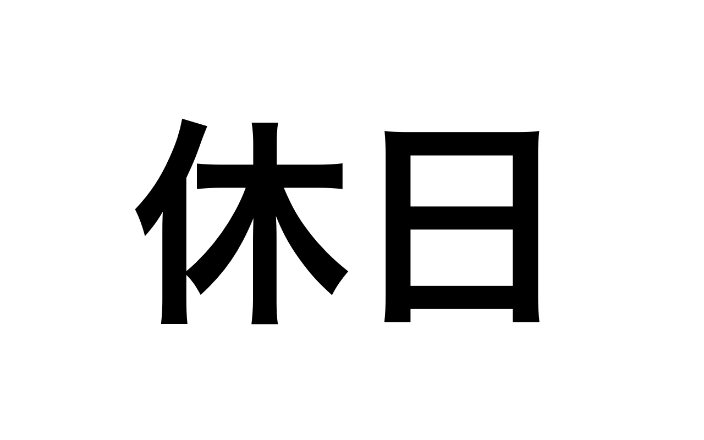

# LongWeekend-iOS

<p align="center">
    
</p>

<p align="center">
  <a href=https://travis-ci.com/funzin/LongWeekend-iOS>
    
  </a>
  <a href=https://codecov.io/gh/funzin/LongWeekend-iOS>
    
  </a>
  
  <a href="https://developer.apple.com/swift">
    
  </a>
  <a href="./LICENSE.md">
    
  </a>
  <a href="https://twitter.com/_funzin">
    
  </a>
</p>

## Overview
 🏖 LongWeekend is iOS Application that supports checking long weekends when taking a vacation in Japan <br>
 Developed using SwiftUI and Combine

## Download
<a href="https://apps.apple.com/us/app/longweekend/id1485137901?mt=8">
    
</a>

## Requirements
- Swift5 or greater
- Xcode11.1 or greater
- [XcodeGen](https://github.com/yonaskolb/XcodeGen) 2.8.0 or greater

## Getting Start
1. If you haven't installed xcodegen yet, please install [XcodeGen](https://github.com/yonaskolb/XcodeGen)
2. Run this command
```
make bootstrap
```
3. Open `LongWeekend.xcworkspace`

## GIF


## Usage
1. Tap setting button
2. Set date, segment, etc.
3. Tap save button
4. Back list view
5. 🏖 


## Screenshot
### JP

Main|Setting
:-:|:-:
|

### EN

Main|Setting
:-:|:-:
|

### Appearance
Light|Dark
:-:|:-:
|

## Contact
If you discover problem or have opinions, please let me know through Github issues💁‍♂️

## Author
funzin
- mail: nakazawa.fumito@gmail.com
- twitter: [@_funzin](https://twitter.com/_funzin)

## License
LongWeekend is available under the MIT license. See the [LICENSE](LICENSE.md) file for more info.
